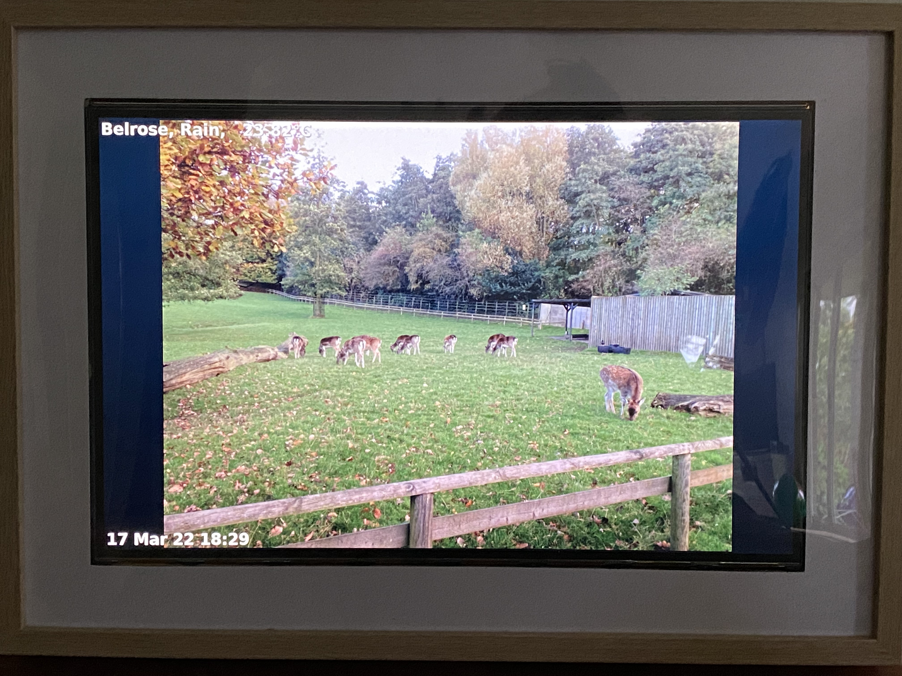

# .NET Pi PictureFrame

A picture frame app for a Raspberry Pi using [.NET 6](https://dotnet.microsoft.com/) and [Avalonia](https://docs.avaloniaui.net/). 

This project is a combination of the Notes made on building applications on a Raspberry Pi with .NET 6.
These include the following Notes

- [.NET development on a Raspberry Pi](https://drneil.github.io/Notebook/Software/Development/dotnetPi.html)
- [.NET Console Clock](https://drneil.github.io/Notebook/Software/Development/ConsoleClock.html)
- [.NET Console Weather](https://drneil.github.io/Notebook/Software/Development/ConsoleWeather.html)
- [.NET GUI application on Raspberry Pi with Avalonia](https://drneil.github.io/Notebook/Software/Development/dotnetPiGUI.html)
- [.NET Picture Frame on Raspberry Pi with Avalonia](https://drneil.github.io/Notebook/Software/Development/dotnetPiPictureFrame.html)
<!-- - [.NET camera feed viewer on Raspberry Pi with Avalonia](https://drneil.github.io/Notebook/Software/Development/dotnetPiCamViewer.html) -->

All the values needed to run this in your environment are coded into the Config.cs class file.

The Config class contains 
- An OpenWeather key 
- A city for which to retrieve the weather 
- A folder with photos to display 

```cs
internal static class Config
{
    internal const string OpenWeather = "your open weather key";
    internal const string WeatherCity = "Sydeny, NSW";
    internal const string PhotosFolder = @"folder to your photos";
    internal const string VideoUrl = @"http://raspberrypi:8080/Video";
}
```

## The Hardware

[A Guide to building the Raspberry Pi Picture frame can be found here](docs/building_hardware.md)


