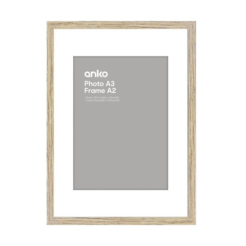
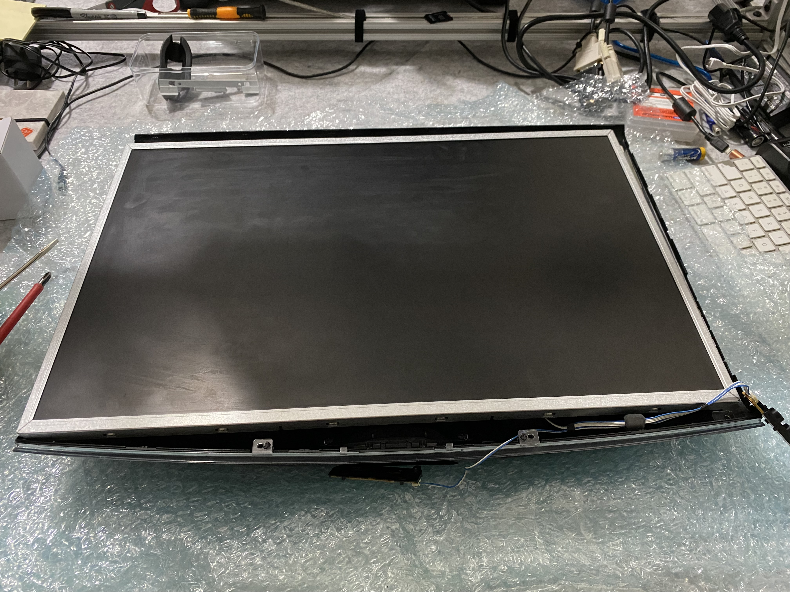
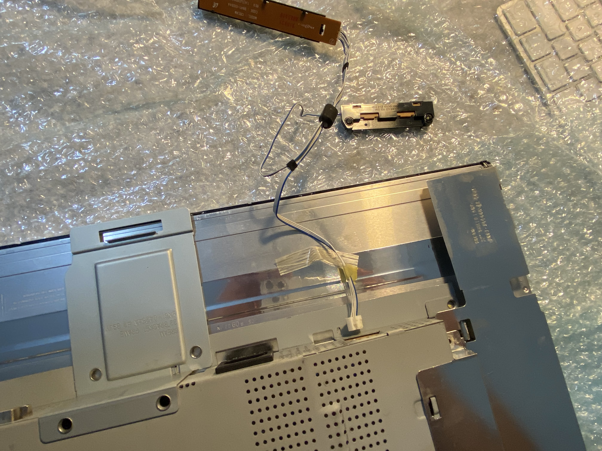
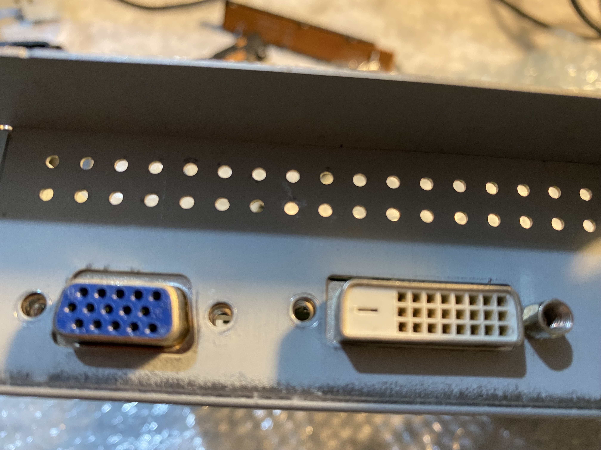

# dotnet Pi PictureFrame
## Building the Hardware

The picture frame built as part of this project was created using an old computer monitor and two picture frames purchased from Kmart.

[Kmart picture frame](https://www.kmart.com.au/product/frame-box-a3-wood-look/2066811)

Take out all the cardboard, frames, backing from the picture frames.
These frames come with a plastic cover for the picture, a cardboard frame that sits behind, then packing and the backboard.

The first step was to take off the plastic outer shell 

The disconnect the power switch, and keep it - you will need this later

The disconnect the two side connectors for the screen (I think these are power)

Then disconnect the ribbon connector for the screen (I think this is the video connection)

Unscrew the video connectors from the frame 

Disconnect and remove the video module

Now everything should be disconnected it is a matter of removing all the screws and places the boards and components carefully to one side.

Then cut out a card frame to put around the screen.

Now to reassemble everything, we are aiming for something like this.

The backing board that holds the picture in the frame then needs holes cut out for the cables to fit through from the screen to the boards that will be mounted behind.

The place the card frame in the picture frame, then the screen, then the backing board.

To hold the screen to 

On the back of the backing board the components can be remounted along with the Raspberry Pi and a power adaptor.

