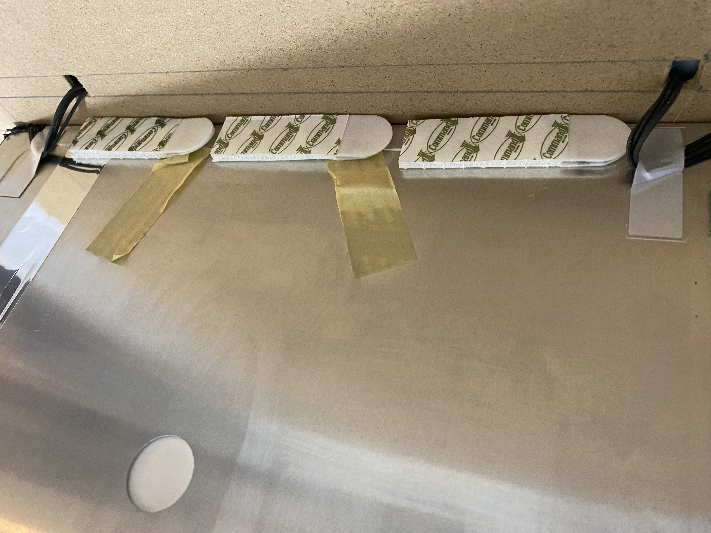

# dotnet Pi PictureFrame
## Building the Hardware

The picture frame built as part of this project was created using an old computer monitor and two picture frames purchased from Kmart.

[Kmart picture frame](https://www.kmart.com.au/product/frame-box-a3-wood-look/2066811)

Take out all the cardboard, frames, backing from the picture frames.
These frames come with a plastic cover for the picture, a white cardboard frame that sits around the picture, then packing and the backboard.

The first step was to take the plastic outer shell away from the monitor.

Disconnect the power switch, and menu buttons, and keep it, you will need this later.

Disconnect the two side connectors for the screen (I think these are power).

Then disconnect the ribbon connector for the screen (I think this is the video connection).

Unscrew the video connectors from the frame.

Disconnect and remove the video module board.

Now everything should be disconnected it is a matter of removing all the screws and placing the boards and components carefully to one side.

Then cut out the white card frame to a size for the screen.

Now to reassemble everything, we are aiming for something like this.

The backing board that holds the picture in the frame then needs holes cut out for the cables to fit through from the screen to the boards that will be mounted behind.

Place the plastic cover sheet into the frame, then the white card frame, then the screen, then the backing board.

To hold the screen to the backing board Velcro picture hanging strips were used. This makes it easier to remove at a future point for maintenance.

On the back of the backing board the components can be mounted along with the Raspberry Pi and a power adaptor. The two wooden blocks shown are glued with wood glue to the backing board. The power adaptor was attached to the backing board with hot-glue.

It is a good idea to test the screen still works before attaching all the components in place for the final time.

